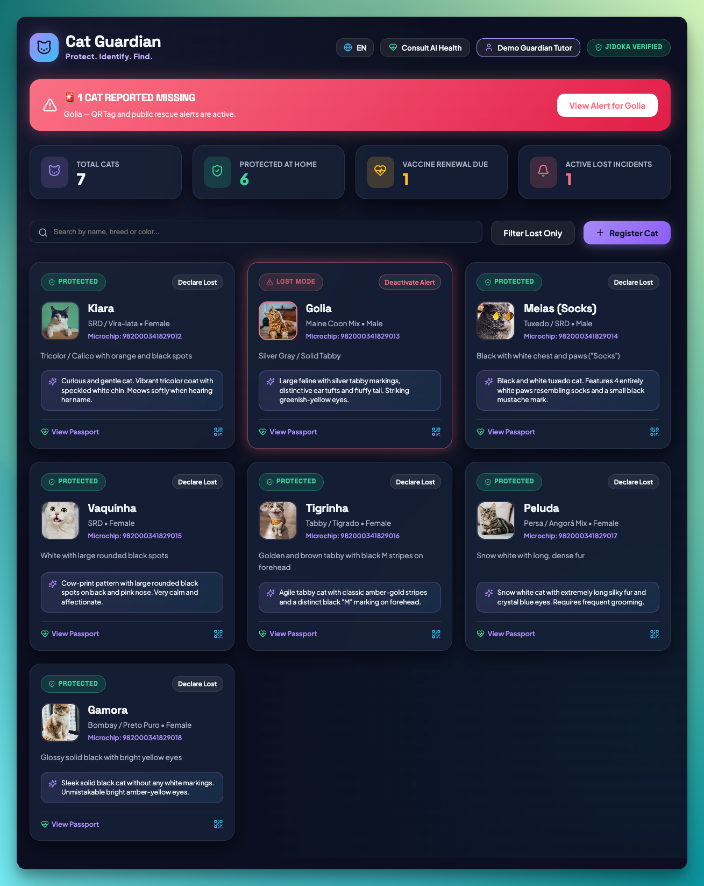
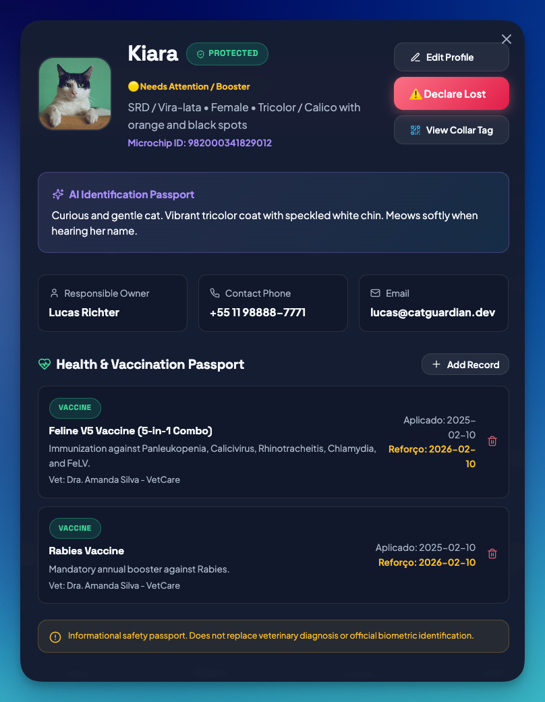
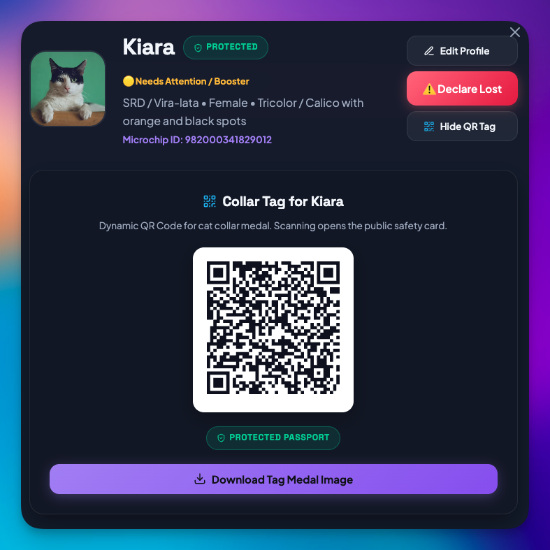
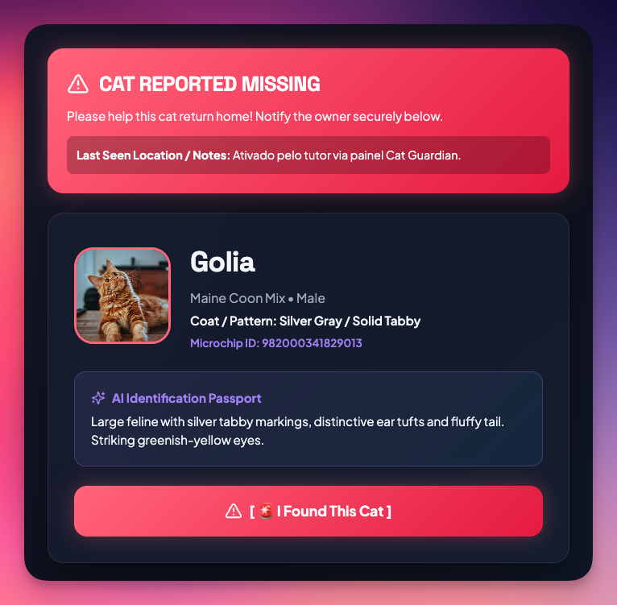
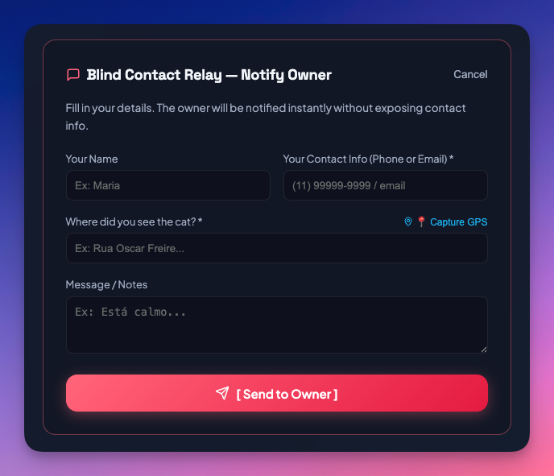
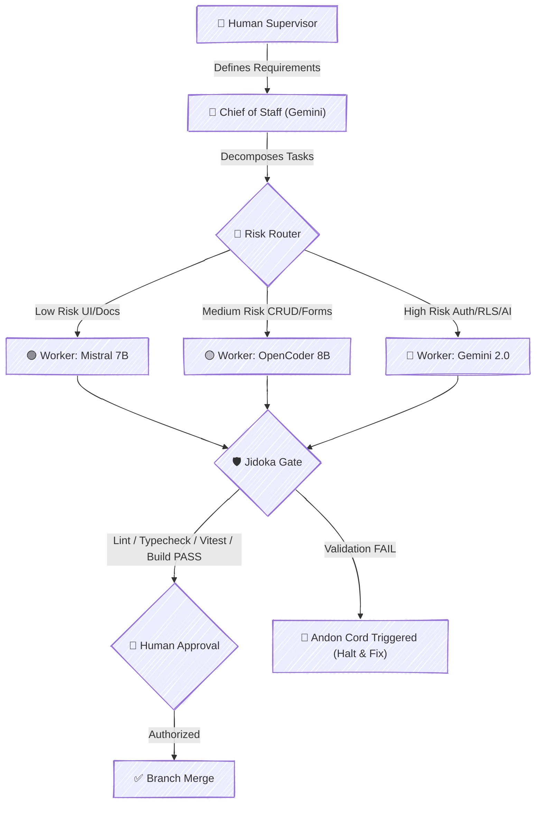

# 🐾 Cat Guardian

<p align="center">
  
  
  
  
</p>

<p align="center">
  <strong>Protect. Identify. Find.</strong><br />
  Digital Safety Passport for Cats — Powered by AI & Privacy-First Engineering
</p>

<p align="center">
  <a href="https://github.com/lfrichter/cat-guardian"><strong>Explore GitHub Repository »</strong></a>
</p>

---

## 🐈 Why I Built It

> **I live with seven cats — Kiara, Golia, Meias, Vaquinha, Tigrinha, Peluda, and Gamora — each with a distinct personality, coat pattern, and care routine. One of my constant concerns is what would happen if one of them slipped out and disappeared.**

Cat Guardian started from that genuine personal problem and evolved into an experiment in combining **privacy-first product design** with **AI-assisted software engineering**.

---

## 🎯 The Problem

> **Losing a pet is stressful. Finding one quickly depends on having the right information available at the right time.**

Traditional paper health records get misplaced, physical collar tags often expose private owner details (phone numbers and home addresses) to anyone in public, and emergency rescue response is fragmented during critical hours.

---

## 💡 The Solution

**Cat Guardian** gives every cat a digital identity that helps protect, identify, and reunite them with their owners safely.

It combines an **AI Identification Passport**, **Dynamic QR Collar Tags**, and a **Blind Contact Relay** system that allows anyone who finds a missing cat to contact the owner instantly — without ever exposing the owner's private contact information.

---

## 🐾 How It Works

```
1. 📝 Register your cat
   Create a digital safety passport with identity, health, and microchip information.

2. 🏷️ Generate a QR collar tag
   Attach the generated QR code medal to your cat's collar.

3. 🚨 If your cat goes missing
   Activate Lost Mode to activate public rescue alerts and broadcast location notes.

4. 📱 If someone finds your cat
   They scan the collar QR code and submit a sighting without seeing your phone or email.

5. ✉️ Get notified safely
   Cat Guardian relays the sighting directly to the owner via secure email notifications.
```

---

## ✨ Key Features

- **Digital Safety Passport**: Centralized health records, vaccination tracking, and microchip registry.
- **AI Visual Description**: Gemini API generates descriptive identification profiles based on visible feline traits.
- **Multilingual JSONB Schema**: Database stores localized AI profiles natively in JSONB (`en` and `pt-BR`).
- **Dynamic QR Collar Tag**: Scannable collar medal encoding emergency rescue passport links.
- **Lost Mode Emergency Broadcast**: One-click emergency alert with visual warning banners.
- **Blind Contact Relay**: Finder-to-owner communication interface powered by **Resend API** (zero contact info exposure).
- **Vaccination Health Tracker**: Visual status indicators (🟢 Up to Date, 🟡 Needs Attention / Booster, ⚪ Unknown).

---

## 🧠 Why AI?

AI is used selectively where it provides meaningful, practical value:

| Domain | AI Capability & Implementation |
| :--- | :--- |
| 🐈 **Visual Description** | Uses Gemini API to generate structured identification profiles from coat patterns, eye color, and distinctive markings. |
| 🩺 **Preventive Health Care** | Provides non-diagnostic preventive wellness guidance and vaccine reminder awareness. |
| 🌎 **Dynamic Localization** | Synthesizes localized AI profiles matching the active user locale (`en` or `pt-BR`). |
| 🤖 **Software Engineering** | AI agents assist implementation under the human-supervised **Framework 2.0** architecture. |

---

## 🚀 Try the Demo

Explore Cat Guardian directly without registering:

> **Demo Mode**: Includes seven pre-registered cat profiles representing the project's real test scenario (**Kiara, Golia, Meias, Vaquinha, Tigrinha, Peluda, Gamora**), with *Golia* pre-configured for emergency lost flow testing.

Click **`✨ Explore Demo Mode`** in the application header or authentication modal for instant access.

---

## 🖼️ Application Screenshots

### 1. Operational Safety Dashboard


### 2. Digital Health Passport & Medical Records


### 3. QR Code Collar Tag Generator


### 4. Public Rescue Passport & Blind Contact Relay




---

## 🏗️ AI-Assisted Engineering Workflow (Framework 2.0)

The project was developed using an AI-assisted engineering workflow based on my **AI Software Engineering Framework 2.0**, featuring a **Risk Router**, multi-agent task execution, and automated **Jidoka Quality Gates**.



---

## 💻 Tech Stack & Architecture

- **Frontend Core**: React 19, Vite 6, TypeScript 5.7.
- **Styling**: Modern Vanilla CSS, Glassmorphism, Midnight Guardian design tokens ([docs/Design-System.md](docs/Design-System.md)).
- **Backend & Database**: Supabase PostgreSQL, Forward-only Migrations, Row Level Security (RLS).
- **Authentication**: Supabase Auth (Email & Password) + Demo Mode Bypass.
- **AI Engine**: `@google/generative-ai` (Gemini 2.0 Flash / Gemini 1.5 Flash).
- **Notifications**: Resend API (Blind Contact Relay email alerts).
- **Internationalization**: `i18next` & `react-i18next` (English default, pt-BR secondary).
- **Testing & Quality Assurance**: Vitest, React Testing Library, ESLint 9, TypeScript strict mode.

---

## 🔐 Privacy & Security

Under strict privacy enforcement:
- The public QR passport **never renders or exposes** owner email addresses, phone numbers, or physical location.
- Finder-to-owner messages are sent via backend relay (**Resend API**) into the database `sightings` table.
- No `mailto:` or `tel:` links are exposed to unauthenticated public visitors.

---

## 🧪 Quality & Jidoka Gate Status

| Stage | Command | Status | Description |
| :--- | :--- | :--- | :--- |
| 1️⃣ **Lint** | `npm run lint` | ✅ **PASS** | ESLint 9 clean verification (0 errors) |
| 2️⃣ **Typecheck** | `npm run typecheck` | ✅ **PASS** | `tsc --noEmit` zero type errors |
| 3️⃣ **Tests** | `npm run test` | ✅ **PASS** | 21 automated tests passing |
| 4️⃣ **Build** | `npm run build` | ✅ **PASS** | Production bundle compiled in Vite 6 |

---

## 🌎 Internationalization (i18n)

Cat Guardian features full internationalization:
- **Default Locale**: English (`en`).
- **Secondary Locale**: Brazilian Portuguese (`pt-BR`).
- **Multilingual Database Engine**: PostgreSQL `JSONB` fields (`ai_profile_localized`) store translated profiles natively.
- **Preserved Identity**: Cat proper names (*Kiara, Golia, Meias, Vaquinha, Tigrinha, Peluda, Gamora*) remain untranslated.

---

## 📋 Implementation Status

### Phase 1 — Foundation & Safety Core
- [x] **EPIC-001: FOUNDATION** — Scaffold Vite 6 + React 19 + TypeScript + Supabase Client + Logging.
- [x] **EPIC-002: CATS** — Seed Data for 7 Cats + Cat Management.
- [x] **EPIC-003: AI** — Gemini API Integration + AI Profile Generator + Preventive Health Assistant.
- [x] **EPIC-004: SAFETY** — Lost Mode Toggle + Dynamic QR Code Collar Tag + Public Rescue Passport.

### Phase 2 — Product Refinement
- [x] **WAVE 1: AUTH & SECURITY** — Supabase Auth, Owner Model, RLS Policies ([supabase/migrations/20260815000001_add_auth_and_rls.sql](supabase/migrations/20260815000001_add_auth_and_rls.sql)).
- [x] **WAVE 2: CAT & HEALTH MANAGEMENT** — Reusable `CatForm` (Create/Edit/Delete), Health Records CRUD, Vaccination Status indicators.
- [x] **WAVE 3: LOST & FOUND FLOW** — Sighting Reports Schema ([supabase/migrations/20260815000002_add_lost_and_found_tables.sql](supabase/migrations/20260815000002_add_lost_and_found_tables.sql)), Blind Contact Relay with Resend Email API.

### Phase 3 — Release Candidate
- [x] **WAVE 4: I18N, DEMO MODE & UX POLISH** — Internationalization (EN / pt-BR), JSONB Multilingual Schema ([supabase/migrations/20260815000003_add_jsonb_localization.sql](supabase/migrations/20260815000003_add_jsonb_localization.sql)), "Explore Demo" Golden Path, AI Language Awareness, Medical Disclaimer, Mobile Polish.
- [x] **WAVE 5: DOCUMENTATION & SUBMISSION** — Final Story-driven README, Architecture Diagram, Jidoka Certification.

---

## 🚀 Quick Start & Local Execution

```bash
# Clone the repository
git clone https://github.com/lfrichter/cat-guardian.git
cd cat-guardian

# Install dependencies
npm install

# Run Vite dev server locally
npm run dev

# Run automated test suite (21 tests)
npm run test

# Run full Jidoka Gate validation pipeline
npm run lint && npm run typecheck && npm run test && npm run build
```

---

## 📄 License & Hackathon Submission

Built for the **DEV Weekend Hackathon**. Released under the MIT License.
