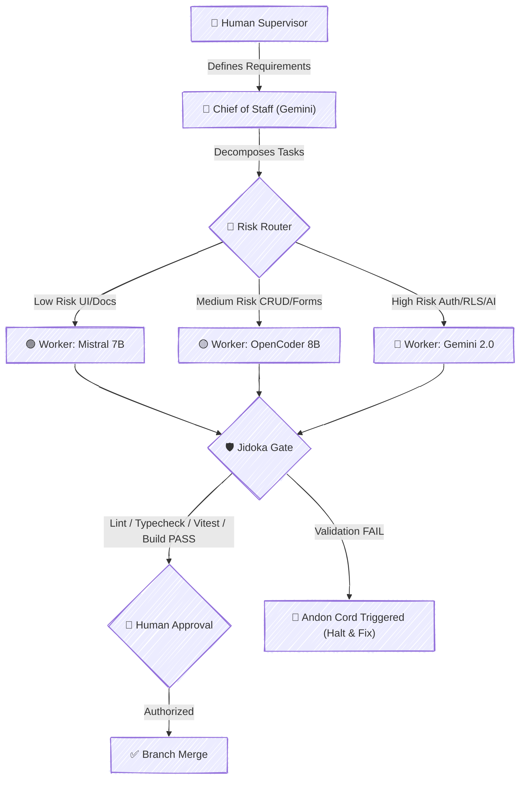

# Cat Guardian 🐾

<p align="center">
  
  
  
  
</p>

<p align="center">
  <strong>Protect. Identify. Find.</strong><br />
  Digital Safety Passport for Cats — Powered by AI & Privacy-First Engineering
</p>

---

## 📌 Executive Summary & Problem Statement

> **Losing a pet is stressful. Finding one quickly can depend on having the right information available at the right time.**

Cat Guardian was created around a simple idea: give every cat a digital identity that can help protect, identify, and reunite them with their owners.

Traditional paper health records get misplaced, physical collar tags often expose private owner details (phone numbers and home addresses) to anyone in public, and emergency rescue response is fragmented during critical hours.

**Cat Guardian** provides:
1. **Digital Safety Passport**: Centralized health records, vaccination tracking, and microchip registry.
2. **AI Visual Identification**: Gemini API generate descriptive identification profiles based on visible traits such as coat pattern, eye color and distinctive markings.
3. **Public QR Code Collar Tag**: A scannable medal attached to the collar linking to a public rescue card.
4. **Blind Contact Relay**: When a missing cat is found, the finder reports a sighting without revealing the owner's phone or email on screen. The system sends email notifications to the owner securely via **Resend API**.

---

## 🎨 Design System: Midnight Guardian

The application interface operates strictly under the **Midnight Guardian Design System** ([docs/Design-System.md](docs/Design-System.md)):

| CSS Variable / Token | Color Hex | Role / Application |
| :--- | :--- | :--- |
| `--color-bg` | `#0B1020` | Primary Application Background (Midnight) |
| `--color-surface` | `#11182B` | Cards & Modals Surface (Deep Navy) |
| `--color-surface-glass` | `#18233A` | Glassmorphism Backdrop Layer |
| `--color-text` | `#F4F7FB` | Main Typography & Headings (Cloud) |
| `--color-text-muted` | `#A8B3C7` | Muted Subtext (Mist) |
| `--color-primary` | `#A78BFA` | Buttons, Active Accents & Controls (Lavender) |
| `--color-primary-light` | `#C4B5FD` | Hover & Highlight States (Soft Violet) |
| `--color-success` | `#34D399` | Protected Status & Up-to-Date Vaccines (Emerald) |
| `--color-warning` | `#FBBF24` | Vaccine Renewal Reminders (Amber) |
| `--color-danger` | `#FB7185` | **LOST MODE ACTIVE** & Emergency Alerts (Coral) |

---

## 🏗️ AI-Assisted Engineering Workflow (Framework 2.0)

The project was developed using an AI-assisted engineering workflow based on my **AI Software Engineering Framework 2.0**, featuring a **Risk Router**, multi-agent task execution, and automated **Jidoka Quality Gates**.



---

## 💻 Tech Stack & Architecture

- **Frontend Core**: React 19, Vite 6, TypeScript 5.7.
- **Styling**: Modern Vanilla CSS, Glassmorphism, Midnight Guardian tokens.
- **Backend & Database**: Supabase PostgreSQL, Forward-only Migrations, Row Level Security (RLS).
- **Authentication**: Supabase Auth (Email & Password) + Demo Mode Bypass.
- **AI Engine**: `@google/generative-ai` (Gemini 2.0 Flash / Gemini 1.5 Flash).
- **Notifications**: Resend API (Blind Contact Relay email alerts).
- **Internationalization**: `i18next` & `react-i18next` (English default, pt-BR secondary).
- **Testing & Quality Assurance**: Vitest, React Testing Library, ESLint 9, TypeScript strict mode.

---

## 📋 Master Backlog & Project Status (100% Completed)

### Phase 1 — Foundation & Safety Core
- [x] **EPIC-001: FOUNDATION** — Scaffold Vite 6 + React 19 + TypeScript + Supabase Client + Logging.
- [x] **EPIC-002: CATS** — Seed Data for 7 Cats (Kiara, Golia, Meias, Vaquinha, Tigrinha, Peluda, Gamora) + Cat Management.
- [x] **EPIC-003: AI** — Gemini API Integration + AI Profile Generator + Preventive Health Assistant.
- [x] **EPIC-004: SAFETY** — Lost Mode Toggle + Dynamic QR Code Collar Tag + Public Rescue Passport.

### Phase 2 — Product Refinement
- [x] **WAVE 1: AUTH & SECURITY** — Supabase Auth, Owner Model, Cat Ownership Association, RLS Policies ([supabase/migrations/20260815000001_add_auth_and_rls.sql](supabase/migrations/20260815000001_add_auth_and_rls.sql)).
- [x] **WAVE 2: CAT & HEALTH MANAGEMENT** — Reusable `CatForm` (Create/Edit/Delete), Health Records CRUD, Vaccination Status indicators (🟢 Up to Date, 🟡 Needs Attention, ⚪ Unknown).
- [x] **WAVE 3: LOST & FOUND FLOW** — Sighting Reports Schema ([supabase/migrations/20260815000002_add_lost_and_found_tables.sql](supabase/migrations/20260815000002_add_lost_and_found_tables.sql)), Public QR Page Architecture, Blind Contact Relay with Resend Email API.

### Phase 3 — Release Candidate
- [x] **WAVE 4: I18N, DEMO MODE & UX POLISH** — Internationalization (EN / pt-BR), JSONB Multilingual Schema ([supabase/migrations/20260815000003_add_jsonb_localization.sql](supabase/migrations/20260815000003_add_jsonb_localization.sql)), "Explore Demo" Golden Path, AI Language Awareness, Medical Disclaimer, Mobile Polish.
- [x] **WAVE 5: DOCUMENTATION & SUBMISSION** — Final README, Architecture Diagram, Jidoka Certification.

---

## 🛡️ Jidoka Gate Pipeline Status

| Stage | Command | Status | Description |
| :--- | :--- | :--- | :--- |
| 1️⃣ **Lint** | `npm run lint` | ✅ **PASS** | ESLint 9 clean verification (0 errors) |
| 2️⃣ **Typecheck** | `npm run typecheck` | ✅ **PASS** | `tsc --noEmit` zero type errors |
| 3️⃣ **Tests** | `npm run test` | ✅ **PASS** | 21 automated tests passing |
| 4️⃣ **Build** | `npm run build` | ✅ **PASS** | Production bundle compiled in Vite 6 |

---

## 🖼️ Application Screenshots

### 1. Operational Safety Dashboard


### 2. Digital Health Passport & Medical Records


### 3. QR Code Collar Tag Generator


### 4. Public Rescue Passport & Blind Contact Relay


---

## 🚀 Quick Start & Local Execution

```bash
# Clone the repository
git clone https://github.com/lfrichter/cat-guardian.git
cd cat-guardian

# Install dependencies
npm install

# Run Vite dev server locally
npm run dev

# Run automated test suite (21 tests)
npm run test

# Run full Jidoka Gate validation pipeline
npm run lint && npm run typecheck && npm run test && npm run build
```

---

## 📄 License & Hackathon Submission

Built for the **DEV Weekend Hackathon**. Released under the MIT License.
